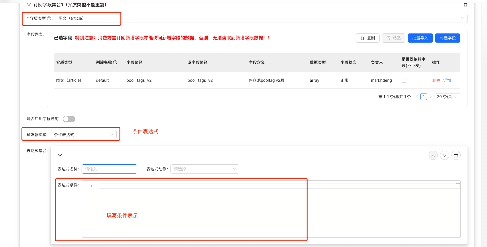
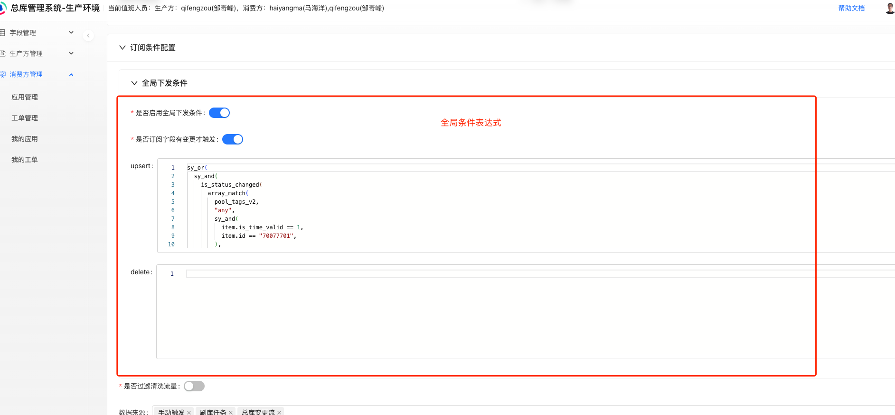

# 目录

[TOC]

## 1. 条件表达式使用场景

1）给特定介质添加分发条件表达式，满足条件才分发。  
适用于：每个订阅介质，条件不一样的情况。



2）全局条件表达式。适用于，订阅多个介质，且每个介质条件一样的情况。

> upsert、delete可理解为预置的条件表达式名称，会随着分发消息一起下发。  
> 目前使用场景，upsert：业务进行增、改操作，delete：业务进行删除操作



## 2. 语法说明

1、遵循golang语法。

示例
```go
entity_type == "thing"
entity_type == "article" && event_data.cp_features.cp_group != nil
```

2、提供辅助函数方便编写表达式。

| 函数名称          | 使用方法或示例                                                                 | 返回值类型 | 函数说明                                                                                                                                                                                                                            |   |
|-------------------|------------------------------------------------------------------------------|------------|-------------------------------------------------------------------------------------------------------------------------------------------------------------------------------------------------------------------------------------|---|
| in_array          | in_array([]string{"hot_event","article","video"}, entity_type)               | bool       | 判断参数1中是否包含参数2                                                                                                                                                                                                            |   |
| array_some<br/>(不推荐) | array_some([]interface{}{val1,val2,val3}, "子属性表达式")<br/>                 | bool       | 数组中是否至少有1个元素满足条件<br/>使用复杂，容易出错，不推荐使用，可以使用array_match函数代替                                                                                                                                      |   |
| case_chain        | case_chain(val0, defaultVal, []interface{}{val1,val2,val3}, newVal0, []int{val4,val5,val6}, newVal1) | bool       | 实现switch case 的函数                                                                                                                                                                                                               |   |
| strval            | strval(val)                                                                  | string     | 转化为字符串值(支持数字转化。复杂结构将执行json.marshal)                                                                                                                                                                            |   |
| in_set            | in_set(val0,"set_name")                                                      | bool       | 是否在名为"set_name"的号码包中                                                                                                                                                                                                       |   |
| join              | join(分隔符, 空值不插入分割符, []interface{}{val0,val1,val2})                   | any        |                                                                                                                                                                                                                                     |   |
| now               | now()                                                                        | int64      | 获取当前时间戳                                                                                                                                                                                                                      |   |
| unix_time         | unix_time(t string)                                                          | int64      | 转化字符串为时间戳                                                                                                                                                                                                                  |   |
| count             | count(v array\|string\|map)                                                  | int        | 获取元素个数                                                                                                                                                                                                                        |   |
| match_reg_exp     | match_reg_exp(reg string,target string)                                      | bool       | 是否匹配正则表达式                                                                                                                                                                                                                  |   |
| in_node           | in_node(node,expr)                                                           | any        | 在node节点下做expr操作                                                                                                                                                                                                               |   |
| float_val         | float_val(val1)                                                              | float64    | 获取float64类型的值                                                                                                                                                                                                                  |   |
| changed           | changed(cmsid,title,…)                                                       | bool       | 检查这些字段的值在变化前后是否改变，返回bool值<br/>只要变更流中有其中一个字段，就返回true                                                                                                                                            |   |
| pick_url_param    | pick_url_param(url string,mustContain string,ks []string)                    | string     | 传入一个url，检查是否包含字符串mustContain，<br/>如果包含，将url中在ks中的参数拼接在一起，返回一个string。                                                                                                                            |   |
| unix_format       | unix_format(val,"2006-01-02 15:04:05")                                        | string     | 把unix时间戳(number)按指定的格式format为string                                                                                                                                                                                      |   |
| is_status_changed | is_status_changed(title == "abc")<br/>is_status_changed(title == "abc",true)   | bool       | 检查表达式在event_data和pre_event_data中的状态是否不一致。<br/>记event_data的判断结果为after，pre_event_data的判断结果为before;<br/>如果after为真，before为假，则返回true;<br/>如果有第二个参数且为真，则如果before为真，after为假，则返回true; |   |
| array_match       | array_match(pool_tags_v2,"any",item.id == "123")<br/>array_match(semantic_emb,"all",item > 3) | bool       | 判断数组的元素是否满足条件，<br/>第一个参数为要判断的数组；<br/>第二个参数为模式类型，支持all(所有元素都要满足)和any(任一元素满足)两种模式；<br/>第三个参数为判断条件，item指代当前元素                                                 |   |
| sy_or             | sy_or(bool1,bool2,bool3,…)                                                   | bool       | 任一条件满足，返回true，否则返回false，相当于 \|\|                                                                                                                                                                                  |   |
| sy_and            | sy_and(bool1,bool2,bool3,…)                                                  | bool       | 所有条件满足，返回true，否则返回false，相当于 &&                                                                                                                                                                                   |   |
| is_focus_changed  | 订阅字段是否有变化                                                           | bool       | 如果订阅的字段有变化，则为真；可在使用expr表达式判断是否下发时使用。bool类型                                                                                                                                                         |   |

## 3. 使用示例

**需求一**：单个字段有变更（例如 `pool_tags_v2`），分发流水
```go
changed(pool_tags_v2)
```

**需求二**：多个字段有变更时，例如title、header、media_status，分发流水  
那么，需要对需求进一步明确：
1. 多个字段同时变更，才分发流水
```go
changed(title) && changed(header) && changed(media_status)
```  
2. 多个字段任意一个变更，就分发流水
```go
changed(title, header, media_status)
```

**需求三**：文章进入pool_tag ，例如：`70077701` ，分发流水。  
那么，需要对需求进一步明确：
1. 文章首次进入pool_tag ，例如：`70077701` ，分发流水。
```go
is_status_changed(
  array_match(
    pool_tags_v2,
    "any",
    sy_and(
      item.is_time_valid == 1,
      item.id == "70077701",
    ),
  )
)
```  
2. pool_tag有变更，且 文章在pool_tag中 ，例如：`70077701` ，分发流水。
```go
changed(pool_tags_v2) && array_match(
  event_data.pool_tags_v2,
  "any",
  sy_and(
    item.is_time_valid == 1,
    item.id == "70077701",
  ),
)
```  
3. 只要文章在pool_tag中 ，例如：`70077701` ，就分发流水。
```go
array_match(
  event_data.pool_tags_v2,
  "any",
  sy_and(
    item.is_time_valid == 1,
    item.id == "70077701",
  ),
)
```

**需求四**：wesee_high_quality_status 变为1才下发
```go
is_status_changed(wesee_high_quality_status == 1) 
// 等价于
changed(wesee_high_quality_status) && event_data.wesee_high_quality_status == 1
```

**需求五**：wesee_high_quality_status 前值不为1 下发
```go
pre_event_data.wesee_high_quality_status != 1
```

**需求六**：video_to_text 不为空  
那么，需要对需求进一步明确：
1. `video_to_text` 字段存在 且 值不为空，才分发流水
```go
video_to_text != nil && video_to_text != ""
```  
2. `video_to_text` 字段不存在，或者 `video_to_text` 字段存在但是值不为空，就分发流水
```go
// 注意这里包括 video_to_text == nil的情况，因为处理文章数据类似为 map[string]any{}，当字段不存在时，虽然值为空，但是类型不为string，所以满足条件
video_to_text != ""
```

**需求七**：文章在`pool_tags_v2` 中3个池子 `"70077701", "69089697", "79520450"` 且 `is_time_valid == 1`  
情况1：文章至少在3个池子中任意一个，就分发流水
```go
array_match(
  event_data.pool_tags_v2, 
  "any", 
  sy_and(
    item.is_time_valid == 1, 
    in_array(["70077701", "69089697", "79520450"], item.id)
  )
)
```
